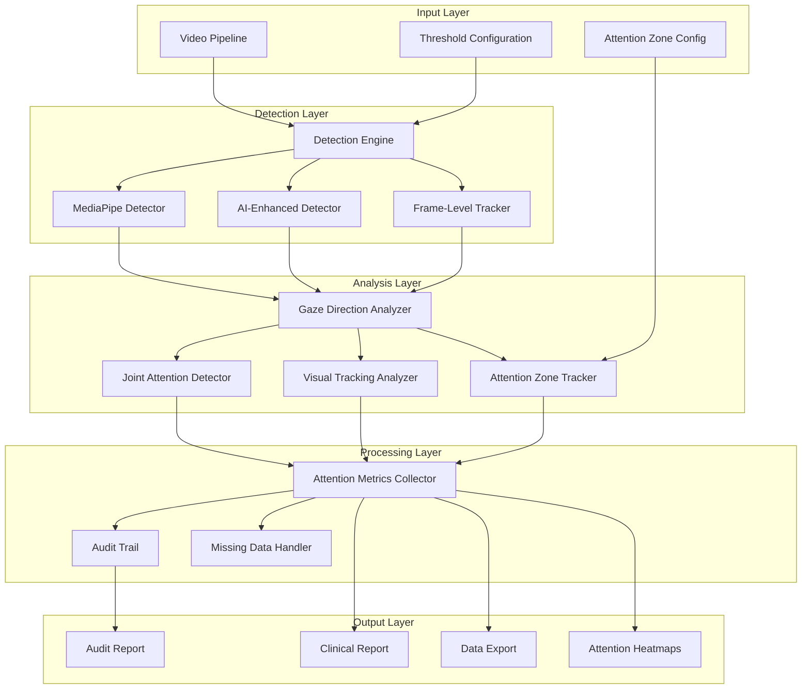

# Design Document: Enhanced Eye Contact & Attention Tracking System

## Overview

The Enhanced Eye Contact & Attention Tracking System provides a comprehensive, multi-approach architecture for analyzing eye contact patterns, gaze direction, joint attention moments, and visual tracking behaviors in behavioral assessment videos. The system addresses current detection limitations by implementing multiple detection algorithms, robust attention metrics aggregation, and clinical-grade auditing capabilities.

The architecture follows a modular design with clear separation between detection engines, gaze analysis, attention tracking, and reporting components. This enables flexible configuration of detection approaches while maintaining consistent data flow and audit trails throughout the analysis pipeline.

Key design principles:
- **Multi-approach flexibility**: Support for episode-based, continuous scoring, and frame-level detection methods
- **Comprehensive attention analysis**: Gaze direction tracking, joint attention detection, and visual scanning pattern analysis
- **Clinical compliance**: Complete audit trails and standardized reporting for regulatory requirements
- **Pipeline integration**: Seamless integration with existing autism analysis infrastructure
- **Robust error handling**: Graceful degradation and missing data management
- **Scalable processing**: Efficient handling of long-duration videos and batch processing

## Architecture

The system follows a layered architecture with the following major components:



### Component Responsibilities

**Detection Engine**: Orchestrates multiple detection approaches, manages threshold configurations, and coordinates frame-by-frame analysis. Acts as the primary interface between the video pipeline and detection algorithms.

**Gaze Direction Analyzer**: Calculates 3D gaze vectors from face landmarks and head pose data. Determines where the subject is looking in world coordinates and classifies gaze targets (camera, objects, off-screen).

**Joint Attention Detector**: Identifies moments when subject and therapist/caregiver focus on the same object or area. Distinguishes between initiated and responding joint attention episodes.

**Visual Tracking Analyzer**: Analyzes eye movement patterns including saccades, fixations, and scanning strategies. Detects atypical visual behaviors and repetitive scanning patterns.

**Attention Zone Tracker**: Monitors attention distribution across predefined regions of interest. Calculates time spent in each zone and tracks attention transitions.

**Attention Metrics Collector**: Aggregates frame-level detections into meaningful clinical metrics, handles temporal windowing, and calculates statistical measures. Maintains real-time processing capabilities for streaming analysis.

**Audit Trail**: Records all detection decisions, configuration changes, and data quality events with precise timestamps. Ensures clinical compliance and enables retrospective analysis validation.

**Missing Data Handler**: Manages detection failures, data gaps, and quality issues. Provides confidence intervals and data completeness metrics for clinical interpretation.

## Components and Interfaces

### Detection Engine Interface

```python
class DetectionEngine:
    def configure_approach(self, approach: DetectionApproach, config: ThresholdConfig) -> None
    def process_frame(self, frame: VideoFrame, timestamp: float) -> FrameResult
    def get_supported_approaches(self) -> List[DetectionApproach]
    def validate_configuration(self, config: ThresholdConfig) -> ValidationResult
```

The Detection Engine supports three primary approaches:

1. **Episode-Based Detection**: Identifies continuous periods of eye contact above minimum duration thresholds
2. **Continuous Scoring**: Provides real-time confidence scores for each frame without binary classification
3. **Frame-Level Tracking**: Generates binary eye contact decisions for individual frames with configurable thresholds

### Gaze Direction Analyzer Interface

```python
class GazeDirectionAnalyzer:
    def calculate_gaze_vector(self, face_landmarks: FaceLandmarks, head_pose: HeadPose) -> GazeVector
    def classify_gaze_target(self, gaze_vector: GazeVector, attention_zones: List[AttentionZone]) -> GazeTarget
    def get_gaze_confidence(self, face_quality: float, landmark_confidence: float) -> float
    def track_gaze_stability(self, gaze_history: List[GazeVector], window_size: int) -> StabilityMetrics
```

### Joint Attention Detector Interface

```python
class JointAttentionDetector:
    def detect_joint_attention(self, subject_gaze: GazeVector, partner_gaze: GazeVector, 
                              objects: List[ObjectLocation]) -> JointAttentionEvent
    def classify_attention_type(self, event: JointAttentionEvent, 
                               temporal_context: TemporalContext) -> AttentionType
    def calculate_attention_alignment(self, gaze_vectors: List[GazeVector]) -> AlignmentScore
    def track_attention_shifts(self, attention_history: List[AttentionEvent]) -> ShiftPattern
```

### Visual Tracking Analyzer Interface

```python
class VisualTrackingAnalyzer:
    def analyze_eye_movements(self, gaze_sequence: List[GazeVector], 
                             timestamps: List[float]) -> EyeMovementMetrics
    def detect_scanning_patterns(self, gaze_path: GazePath, 
                                attention_zones: List[AttentionZone]) -> ScanningPattern
    def calculate_fixation_metrics(self, gaze_sequence: List[GazeVector]) -> FixationMetrics
    def identify_repetitive_behaviors(self, visual_patterns: List[VisualPattern]) -> RepetitiveBehaviors
```

### Attention Zone Tracker Interface

```python
class AttentionZoneTracker:
    def configure_zones(self, zone_definitions: List[ZoneDefinition]) -> None
    def track_zone_attention(self, gaze_vector: GazeVector, timestamp: float) -> ZoneAttentionEvent
    def calculate_zone_metrics(self, time_window: TimeWindow) -> ZoneMetrics
    def generate_attention_heatmap(self, attention_data: List[ZoneAttentionEvent]) -> AttentionHeatmap
    def detect_zone_transitions(self, attention_sequence: List[ZoneAttentionEvent]) -> TransitionPattern
```

### Attention Metrics Collector Interface

```python
class AttentionMetricsCollector:
    def add_frame_result(self, result: FrameResult) -> None
    def add_gaze_data(self, gaze_vector: GazeVector, timestamp: float) -> None
    def add_joint_attention_event(self, event: JointAttentionEvent) -> None
    def add_visual_tracking_data(self, tracking_data: VisualTrackingData) -> None
    def calculate_comprehensive_metrics(self, window_size: timedelta) -> ComprehensiveMetrics
    def get_attention_distribution(self) -> AttentionDistribution
    def export_attention_data(self, format: ExportFormat) -> ExportData
    def get_attention_quality_report(self) -> AttentionQualityReport
```

### Audit Trail Interface

```python
class AuditTrail:
    def log_detection_decision(self, timestamp: float, decision: bool, confidence: float) -> None
    def log_configuration_change(self, config: ThresholdConfig, timestamp: float) -> None
    def log_missing_data_event(self, start_time: float, duration: float, cause: str) -> None
    def generate_audit_report(self, time_range: TimeRange) -> AuditReport
    def export_audit_data(self, format: ExportFormat) -> ExportData
```

### Integration Points

**Video Pipeline Integration**: The system receives video frames through the existing pipeline interface, maintaining compatibility with current autism analysis modules. Frame processing occurs in parallel with other behavioral analysis components.

**Configuration Integration**: Threshold configurations extend the existing `configs/thresholds.yaml` structure with eye contact-specific parameters while maintaining backward compatibility.

**Report Integration**: Clinical reports integrate with existing report generation infrastructure, adding eye contact metrics to comprehensive behavioral assessments.

## Data Models

### Core Data Structures

```python
@dataclass
class FrameResult:
    timestamp: float
    confidence_score: float
    binary_decision: bool
    detection_approach: DetectionApproach
    gaze_vector: Optional[GazeVector]
    gaze_target: Optional[GazeTarget]
    quality_flags: List[QualityFlag]
    processing_metadata: Dict[str, Any]

@dataclass
class GazeVector:
    x: float  # Horizontal gaze direction (-1 to 1, left to right)
    y: float  # Vertical gaze direction (-1 to 1, down to up)
    z: float  # Depth component (0 to 1, near to far)
    confidence: float
    timestamp: float

@dataclass
class JointAttentionEvent:
    start_time: float
    end_time: float
    duration: float
    attention_type: AttentionType  # INITIATED, RESPONDING, MUTUAL
    target_object: Optional[str]
    alignment_score: float
    confidence: float

@dataclass
class VisualTrackingData:
    timestamp: float
    eye_movement_velocity: float
    saccade_count: int
    fixation_duration: float
    scanning_pattern: ScanningPattern
    repetitive_behavior_score: float

@dataclass
class AttentionZoneEvent:
    zone_id: str
    zone_name: str
    entry_time: float
    exit_time: float
    duration: float
    attention_intensity: float  # Average gaze confidence in zone

@dataclass
class EpisodeData:
    start_time: float
    end_time: float
    duration: float
    average_confidence: float
    peak_confidence: float
    quality_score: float
    associated_gaze_data: List[GazeVector]
    joint_attention_events: List[JointAttentionEvent]

@dataclass
class ComprehensiveMetrics:
    window_start: float
    window_end: float
    # Eye contact metrics
    total_duration: float
    eye_contact_duration: float
    eye_contact_percentage: float
    episode_count: int
    average_episode_duration: float
    max_episode_duration: float
    inter_episode_intervals: List[float]
    # Gaze direction metrics
    gaze_direction_distribution: Dict[str, float]
    average_gaze_stability: float
    gaze_shift_frequency: float
    # Joint attention metrics
    joint_attention_episodes: int
    joint_attention_duration: float
    initiated_attention_ratio: float
    attention_response_latency: float
    # Visual tracking metrics
    average_fixation_duration: float
    saccade_frequency: float
    scanning_pattern_complexity: float
    repetitive_behavior_score: float
    # Attention zone metrics
    zone_attention_distribution: Dict[str, float]
    zone_transition_frequency: float
    preferred_attention_zones: List[str]
    # Data quality
    data_completeness: float
    gaze_tracking_quality: float

@dataclass
class AuditEntry:
    timestamp: float
    event_type: AuditEventType
    detection_approach: DetectionApproach
    threshold_config: ThresholdConfig
    gaze_data_quality: float
    attention_tracking_quality: float
    data_quality: float
    metadata: Dict[str, Any]
```

### Configuration Models

```python
@dataclass
class ThresholdConfig:
    detection_approach: DetectionApproach
    confidence_threshold: float
    minimum_episode_duration: float
    temporal_smoothing: bool
    # Gaze direction parameters
    gaze_stability_threshold: float
    gaze_shift_sensitivity: float
    # Joint attention parameters
    joint_attention_alignment_threshold: float
    attention_response_latency_threshold: float
    # Visual tracking parameters
    fixation_duration_threshold: float
    saccade_velocity_threshold: float
    # Attention zone parameters
    zone_entry_threshold: float
    zone_transition_sensitivity: float
    population_profile: PopulationProfile
    quality_requirements: QualityRequirements

@dataclass
class AttentionZoneConfig:
    zone_id: str
    zone_name: str
    zone_type: ZoneType  # FACE, OBJECT, BACKGROUND, CUSTOM
    coordinates: ZoneCoordinates  # Bounding box or polygon
    is_dynamic: bool  # Whether zone moves with objects/people
    tracking_sensitivity: float
    minimum_dwell_time: float

@dataclass
class PopulationProfile:
    age_group: AgeGroup
    clinical_population: ClinicalPopulation
    normative_data: Optional[NormativeData]
    custom_thresholds: Dict[str, float]
    # Attention-specific norms
    typical_joint_attention_frequency: Optional[float]
    typical_gaze_stability: Optional[float]
    typical_attention_zone_preferences: Optional[Dict[str, float]]

@dataclass
class QualityRequirements:
    minimum_data_completeness: float
    maximum_missing_duration: float
    confidence_interval_level: float
    outlier_detection_enabled: bool
    # Attention tracking quality requirements
    minimum_gaze_tracking_quality: float
    minimum_face_detection_rate: float
    maximum_gaze_estimation_error: float
```

### Export Data Models

```python
@dataclass
class ClinicalReport:
    subject_id: str
    analysis_timestamp: datetime
    video_duration: float
    overall_metrics: ComprehensiveMetrics
    temporal_breakdown: List[ComprehensiveMetrics]
    episode_details: List[EpisodeData]
    joint_attention_summary: JointAttentionSummary
    visual_tracking_summary: VisualTrackingSummary
    attention_zone_summary: AttentionZoneSummary
    attention_heatmaps: List[AttentionHeatmap]
    data_quality_summary: AttentionQualityReport
    clinical_interpretation: ClinicalInterpretation
    audit_summary: AuditSummary

@dataclass
class JointAttentionSummary:
    total_episodes: int
    total_duration: float
    initiated_episodes: int
    responding_episodes: int
    average_response_latency: float
    attention_alignment_quality: float

@dataclass
class VisualTrackingSummary:
    average_fixation_duration: float
    saccade_frequency: float
    dominant_scanning_pattern: ScanningPattern
    repetitive_behavior_incidents: int
    visual_attention_stability: float

@dataclass
class AttentionZoneSummary:
    zone_metrics: Dict[str, ZoneMetrics]
    transition_patterns: List[TransitionPattern]
    preferred_zones: List[str]
    attention_distribution_entropy: float

@dataclass
class AttentionHeatmap:
    zone_id: str
    time_window: TimeWindow
    attention_density: np.ndarray
    peak_attention_coordinates: List[Coordinate]
    attention_centroid: Coordinate

@dataclass
class ExportData:
    format: ExportFormat
    data_type: DataType
    timestamp_range: TimeRange
    frame_level_data: Optional[List[FrameResult]]
    gaze_vector_data: Optional[List[GazeVector]]
    joint_attention_events: Optional[List[JointAttentionEvent]]
    visual_tracking_data: Optional[List[VisualTrackingData]]
    attention_zone_events: Optional[List[AttentionZoneEvent]]
    aggregated_metrics: Optional[List[ComprehensiveMetrics]]
    audit_entries: Optional[List[AuditEntry]]
    attention_heatmaps: Optional[List[AttentionHeatmap]]
    metadata: ExportMetadata
```

### Data Flow Architecture

The system processes data through the following pipeline:

1. **Frame Ingestion**: Video frames arrive from the existing pipeline with timestamps and metadata
2. **Detection Processing**: Each frame is analyzed by the configured detection approach, generating confidence scores and binary decisions
3. **Quality Assessment**: Frame results are evaluated for data quality, flagging potential issues or missing data
4. **Metrics Aggregation**: Frame-level results are aggregated into temporal windows, calculating frequency, duration, and statistical measures
5. **Audit Logging**: All processing decisions and data quality events are recorded in the audit trail
6. **Report Generation**: Clinical reports are generated combining metrics, quality assessments, and audit summaries

The architecture supports both real-time streaming analysis and batch processing of recorded videos, with consistent data models and processing logic across both modes.

## Correctness Properties

*A property is a characteristic or behavior that should hold true across all valid executions of a system-essentially, a formal statement about what the system should do. Properties serve as the bridge between human-readable specifications and machine-verifiable correctness guarantees.*

### Property 1: Detection Approach Consistency
*For any* video analysis session, when a detection approach is selected, all frames in that session should be processed using the same detection approach consistently.
**Validates: Requirements 1.2**

### Property 2: Multi-Approach Comparison Capability  
*For any* video input, when multiple detection approaches are available, the system should be able to execute different approaches on the same video data and provide comparable results.
**Validates: Requirements 1.5**

### Property 3: Comprehensive Metrics Calculation
*For any* set of frame-level eye contact data and temporal window configuration, the metrics collector should calculate duration, frequency, percentage, and statistical measures that are mathematically consistent with the input data.
**Validates: Requirements 2.1, 2.2, 2.3, 2.4, 2.5, 2.6**

### Property 4: Frame Processing Completeness
*For any* video frame sequence, the detection engine should generate confidence scores for every frame, store them with precise timestamps, and apply thresholds consistently to produce binary decisions.
**Validates: Requirements 3.1, 3.2, 3.3, 3.4**

### Property 5: Rapid State Change Detection
*For any* frame sequence with rapid eye contact state transitions, the system should detect and flag these transitions as potential detection errors.
**Validates: Requirements 3.5**

### Property 6: Complete Audit Trail Logging
*For any* detection decision, configuration change, or data quality event, the audit trail should record all relevant information with precise timestamps and complete metadata.
**Validates: Requirements 4.1, 4.2, 4.3, 4.4**

### Property 7: System Resilience Under Failures
*For any* sequence of processing operations that includes temporary failures, the system should continue analysis after failures, record missing data gaps, and maintain data integrity.
**Validates: Requirements 6.1, 6.2, 6.3**

### Property 8: Data Quality Assessment
*For any* analysis session with varying data completeness, the system should provide confidence intervals and generate warnings when data quality falls below configured thresholds.
**Validates: Requirements 6.4, 6.5**

### Property 9: Clinical Deviation Detection
*For any* eye contact measurement data that contains significant deviations from expected patterns, the clinical report should highlight these deviations appropriately.
**Validates: Requirements 7.3**

### Property 10: Configuration Validation and Compatibility
*For any* threshold configuration change, the system should validate the configuration parameters, reject invalid combinations, and maintain backward compatibility with existing analyses.
**Validates: Requirements 8.2, 8.4, 8.5**

### Property 11: Export Data Completeness
*For any* data export request with specified temporal resolution, the exported data should include all requested information with complete metadata about detection methods and parameters.
**Validates: Requirements 10.4, 10.5**

### Property 12: Gaze Direction Accuracy
*For any* frame with successful face detection, the gaze direction analyzer should produce consistent gaze vectors that align with head pose data and maintain temporal coherence.
**Validates: Requirements 1.4, 1.5**

### Property 13: Joint Attention Detection Consistency
*For any* sequence of gaze vectors from multiple subjects, the joint attention detector should identify alignment events consistently and classify attention types accurately.
**Validates: Requirements 11.1, 11.2, 11.3**

### Property 14: Visual Tracking Pattern Recognition
*For any* sequence of gaze movements, the visual tracking analyzer should detect scanning patterns, calculate fixation metrics, and identify repetitive behaviors consistently.
**Validates: Requirements 12.1, 12.2, 12.3, 12.4**

### Property 15: Attention Zone Tracking Accuracy
*For any* configured attention zones and gaze vector sequence, the attention zone tracker should accurately determine zone occupancy, calculate dwell times, and track transitions.
**Validates: Requirements 13.1, 13.2, 13.3, 13.4, 13.5, 13.6**

### Property 16: Comprehensive Metrics Integration
*For any* combination of eye contact, gaze direction, joint attention, and visual tracking data, the attention metrics collector should produce integrated metrics that are mathematically consistent across all measurement domains.
**Validates: Requirements 2.7, 2.8**

## Error Handling

The system implements comprehensive error handling across all components to ensure clinical-grade reliability:

### Detection Engine Error Handling
- **Frame Processing Failures**: When individual frames cannot be processed, the system logs the failure, records the timestamp gap, and continues with subsequent frames
- **Algorithm Failures**: If a detection approach fails, the system can fall back to alternative approaches or continue with reduced functionality
- **Configuration Errors**: Invalid threshold configurations are rejected with detailed error messages and suggested corrections

### Data Quality Management
- **Missing Data Detection**: The system continuously monitors for missing or corrupted frame data and maintains quality metrics
- **Confidence Interval Calculation**: Statistical confidence intervals are calculated based on data completeness and quality indicators
- **Quality Threshold Enforcement**: Configurable quality thresholds trigger warnings and affect confidence calculations

### Audit Trail Integrity
- **Logging Failures**: If audit logging fails, the system attempts alternative logging mechanisms and generates alerts
- **Data Consistency**: Audit trail consistency is verified through checksums and sequence validation
- **Recovery Mechanisms**: The system can recover partial audit trails and reconstruct missing entries where possible

### Clinical Report Error Handling
- **Incomplete Data Reporting**: Reports clearly indicate when data is incomplete and provide confidence levels for all metrics
- **Normative Data Unavailability**: When normative comparisons cannot be made, reports explain the limitation and provide alternative interpretations
- **Format Validation**: All report outputs are validated against clinical documentation standards before generation

## Testing Strategy

The Enhanced Eye Contact Metrics System requires comprehensive testing to ensure clinical-grade reliability and accuracy. The testing approach combines property-based testing for universal correctness validation with targeted unit testing for specific scenarios and edge cases.

### Dual Testing Approach

**Property-Based Testing**: Validates universal properties across all possible inputs using randomized test data generation. Each correctness property from the design document is implemented as a property-based test with minimum 100 iterations to ensure comprehensive coverage.

**Unit Testing**: Focuses on specific examples, integration points, edge cases, and error conditions that require precise validation. Unit tests complement property tests by providing concrete examples and testing specific scenarios that may be difficult to generate randomly.

### Property-Based Test Configuration

The system uses **Hypothesis** (Python) for property-based testing with the following configuration:
- **Minimum 100 iterations** per property test to ensure statistical significance
- **Custom generators** for video frame data, temporal windows, and configuration parameters
- **Shrinking strategies** to find minimal failing examples when tests fail
- **Deterministic seeding** for reproducible test runs in clinical environments

Each property test is tagged with a comment referencing its design document property:
```python
# Feature: enhanced-eye-contact-metrics, Property 1: Detection Approach Consistency
```

### Test Categories

**Core Algorithm Testing**:
- Detection approach consistency across video sessions
- Metrics calculation accuracy for various temporal windows
- Frame-level processing completeness and accuracy
- Threshold application and binary decision generation

**Data Quality and Resilience Testing**:
- Missing data handling and gap recording
- System recovery after temporary failures
- Data quality assessment and confidence interval calculation
- Rapid state change detection and flagging

**Integration and Compatibility Testing**:
- Video pipeline integration without architectural changes
- Configuration file compatibility and validation
- Clinical report format compliance
- Export format validation and metadata inclusion

**Clinical Compliance Testing**:
- Audit trail completeness and integrity
- Clinical documentation standard compliance
- Normative comparison accuracy when data is available
- Error reporting and confidence level communication

### Test Data Management

**Synthetic Data Generation**: Property tests generate realistic video frame sequences, eye contact patterns, and configuration parameters to test system behavior across the full input space.

**Clinical Test Cases**: Unit tests use anonymized clinical data patterns to validate system behavior with real-world scenarios while maintaining patient privacy.

**Edge Case Coverage**: Specific tests for boundary conditions, error scenarios, and unusual data patterns that may occur in clinical settings.

### Performance and Scalability Testing

While not part of property-based testing, the system includes performance benchmarks to ensure clinical workflow compatibility:
- **Processing speed** comparable to existing analysis modules
- **Memory usage** optimization for long-duration videos
- **Batch processing** capability validation
- **Parallel processing** efficiency when multiple approaches are used

### Continuous Integration

All tests run automatically on code changes with:
- **Property test execution** with full iteration counts
- **Unit test coverage** reporting and threshold enforcement
- **Integration test validation** against existing pipeline components
- **Clinical compliance verification** for all output formats

The testing strategy ensures that the Enhanced Eye Contact Metrics System meets clinical reliability standards while maintaining compatibility with existing behavioral analysis infrastructure.